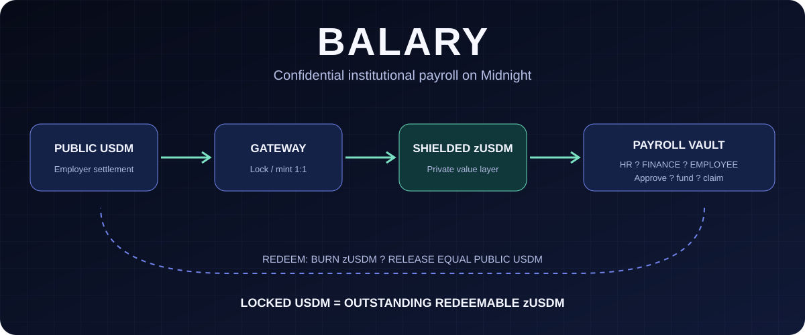
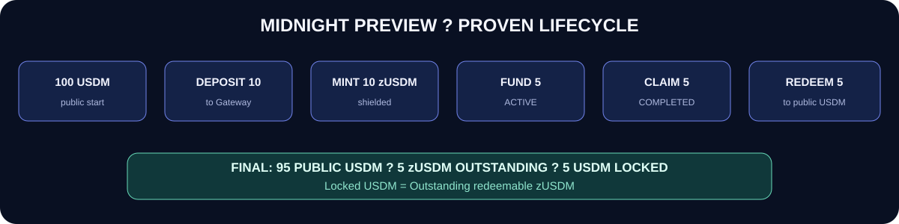
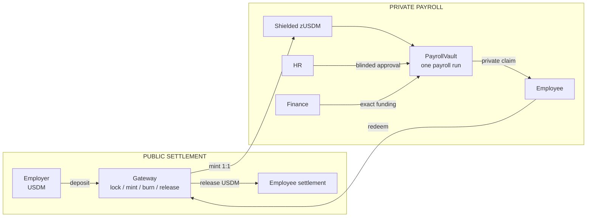

<div align="center">



# Balary

**Confidential institutional USDM payroll on Midnight.**

[](https://github.com/Sparexonzy95/balary/actions/workflows/ci.yml)


[](LICENSE)

> **Every redeemable zUSDM is backed 1:1 by USDM locked in the Balary Gateway.**

`USDM locked in Gateway = outstanding redeemable zUSDM`

[Preview proof](docs/technical/PREVIEW_PROOF.md) ? [Architecture](docs/technical/ARCHITECTURE.md) ? [Run verification](#run-the-proof) ? [Demo guide](docs/guides/DEMO_GUIDE.md) ? [Documentation](docs/README.md) ? [Buildathon submission](docs/submission/BUILDATHON_SUBMISSION.md)

</div>

Balary combines public stablecoin settlement with private payroll execution. An employer locks public USDM and receives equal shielded `zUSDM`. HR privately approves exact salary instructions, Finance funds only those instructions, and an employee privately proves entitlement to claim a dedicated salary coin. Redemption burns zUSDM and releases equal public USDM.

`zUSDM` is not an independent stablecoin, synthetic dollar, AMM asset, oracle-pegged token, or ShieldUSD dependency. It is Balary's shielded representation of USDM already locked in the Gateway.

## Preview proof

The complete deposit ? payroll ? claim ? redemption lifecycle ran on Midnight Preview with external Preview USDM (six decimal places).

| Evidence | Preview value |
|---|---|
| Preview USDM color | `003bacd9a361ba0d425e408776020e40271375e8b8de42d73eec046a44947d73` |
| Gateway | `34c67f4d4bbd15ac8cb4fa267b1162b59038a344606f8d1b52813ad7ab35c0b4` |
| Deposit 10 USDM | `1809a3807ff95ff644c6b383c0b851b955aa7a295765cf2b575a31b63113a73d` |
| PayrollVault | `1d5f51e61f0f990aabfcb5f4c91d0a416c3b9b091ab7fdf5f7712c931108a825` |
| Fund 5 zUSDM | `37dc07d60cc38c7b7c3d4da19f22d9dbf1f737da97bf084fb64be158a6d4fec6` |
| Claim 5 zUSDM | `f7c1579d2ad03e8c60a7f43ace75e2aa3f2df08cf1379ce62edad9d1924381ce` |
| Redeem 5 zUSDM | `4e03d2a140f45f00dbce1044bce63adeef1e0d85aba88d886a46e4909e0f7e33` |
| Final invariant | `5,000,000 locked USDM = 5,000,000 outstanding zUSDM` |



The final Preview claim used the employer wallet for both roles because a new employee wallet needed time to accumulate tDUST. A genuinely separate employer/employee wallet claim was proven locally. See the [complete evidence record](docs/technical/PREVIEW_PROOF.md).

## Why Balary exists

Public-chain payroll can expose salaries, payment relationships, history, and workforce financial information. Privacy alone is insufficient: institutions also need HR to define salaries, Finance to fund only approved instructions, administrators to manage authority, and employees to claim only their allocations. Midnight lets Balary keep sensitive inputs private while retaining verifiable lifecycle state and public settlement.

## How it works



1. The Gateway receives configured public USDM and mints equal shielded zUSDM.
2. HR commits a private employee identity, exact salary, allocation data, and blinds.
3. Finance transfers one exact zUSDM coin matching the approved intent.
4. The vault becomes `ACTIVE` only when every expected allocation is approved and funded.
5. The employee proves secret-derived identity and Merkle membership and receives the whole salary coin.
6. Claims complete the run; eligible cancellation/expiry paths recover only unclaimed coins.
7. Redemption burns zUSDM and releases equal public USDM.

## Core contracts

| Contract | Responsibility |
|---|---|
| [Gateway](contracts/BalaryStablecoinGateway.compact) | Pins USDM color; locks, mints, burns, releases; enforces equal locked/outstanding totals. |
| [PayrollVault](contracts/BalaryPayrollVault.compact) | One immutable payroll run with approval, funding, claims, cancellation, expiry, recovery, and role rotation. |
| [MockUSDM](contracts/MockUSDM.compact) | Development-only public token. Preview uses external USDM. |

## Privacy and institutional controls

The vault has no public employee-to-salary map. Each allocation is a dedicated shielded coin. HR intents and allocations use `persistentCommit` with private randomness and a depth-20 Merkle tree. Secret-derived identities and authorities are domain separated. Nullifiers and coin consumption prevent reuse.

| Data | Visibility |
|---|---|
| USDM transfers, Gateway totals, contract addresses | Public |
| Payroll state, roots/commitments, aggregate counts, disclosed nullifiers | Public; counts may leak workforce-size metadata |
| Employee identity, salary, blinds, openings, Merkle path | Private inputs |
| Role secrets and HR intent opening | Private inputs |
| Redemption recipient and released USDM | Public at the deliberate exit boundary |

| Role | Can | Cannot |
|---|---|---|
| Admin | Rotate authorities; cancel during `FUNDING` | Approve/fund salaries; cancel `ACTIVE` payroll |
| HR | Privately approve an exact salary intent | Move funds |
| Finance | Fund exact approved allocation; recover eligible unclaimed coins | Invent/alter salaries; recover claimed coins |
| Employee | Prove and claim exact entitlement | Claim another allocation or claim twice |

Raw role secrets never enter ledger state. `ownPublicKey()` is a destination after authorization, not institutional authentication. See [Protocol](docs/technical/PROTOCOL.md), [Privacy & security](docs/technical/PRIVACY_SECURITY.md), and [Roles](docs/technical/INSTITUTIONAL_ROLES.md).

## Run the proof

Node.js 22+ is required. CI runs the deterministic, secret-free checks:

```bash
npm ci
npm run check:contracts
npm run test:model
```

Expected: 32 static architecture/security checks and 42 model tests. With Compact devtools/compiler `0.31.1` installed, run:

```bash
npm run gate
```

This also compiles all three Compact-language `0.23` contracts and ends with `SUCCESS: MockUSDM, Gateway, and PayrollVault compiled and model tests passed.`

Local/Preview runners need services, wallet state, and private inputs and are excluded from CI. Preview also needs spendable tDUST, a proof server, correct USDM, and protected secrets. Follow [Local development](docs/guides/LOCAL_DEVELOPMENT.md).

## Engineering decisions

| Decision | Problem solved |
|---|---|
| Public USDM plus shielded zUSDM | Preserves public settlement while adding private execution. |
| No oracle, AMM, pool, or swap | Backing is custody plus equal mint/burn accounting, not a synthetic peg. |
| One vault per run | Freezes institution, payroll, Gateway, count, and deadline. |
| HR/Finance separation | Prevents the fund mover from inventing or changing salaries. |
| Randomized commitments | Avoids a public salary map and salary-value guessing. |
| Secret-derived identities | Avoids wallet-key authentication via `ownPublicKey()`. |
| Whole salary coins | Avoids shared change accounting and claim contention. |
| Public redemption | Makes the settlement privacy boundary explicit. |
| Trusted/local proving | A remote prover may observe witness data. |

## Trust, status, and limitations

Gateway checks cover color, reserves, and equal accounting. Vault checks cover authorities, exact intents, Merkle membership, deadlines, and nullifiers. Claimed coins cannot be recovered because they are consumed. Sensitive proving still requires a trusted/local prover; secrets need off-chain custody; counts leak metadata; and redemption is public. There is no claimed audit or formal verification.

| Capability | Local | Preview | Notes |
|---|---|---|---|
| Deposit / zUSDM mint | Proven with MockUSDM | Proven with external USDM | 1:1 representation |
| HR approval / Finance funding | Proven | Proven | Exact private intent |
| Employee claim | Proven | Proven | Preview used employer wallet |
| Separate employer/employee wallets | Proven | Not yet demonstrated | tDUST timing constraint |
| zUSDM redemption | Proven | Proven | Releases public USDM |
| Mainnet | Not applicable | Not deployed | Preview is not production |

No institution registry, production onboarding layer, dashboard, external audit, or mainnet deployment exists today. Roadmap: separate-wallet Preview proof, sponsored fees, onboarding, dashboards, batches, metadata hardening, security review, and a mainnet path.

## Technology and layout

Compact, Midnight.js 4.1.1, Wallet SDK 1.2.0, TypeScript, Node, a protocol model, and Docker Compose.

```text
contracts/       Compact contracts
src/contracts/   generated-contract adapters
src/local/       local MockUSDM runners
src/preview/     Preview external-USDM runners
model/ + test/   executable model and 42 tests
scripts/         checks, compilation, hard gate
docs/            product, technical, guides, proof, submission
.github/         secret-free CI
```

Start at the [documentation index](docs/README.md). Licensed under [Apache 2.0](LICENSE).
