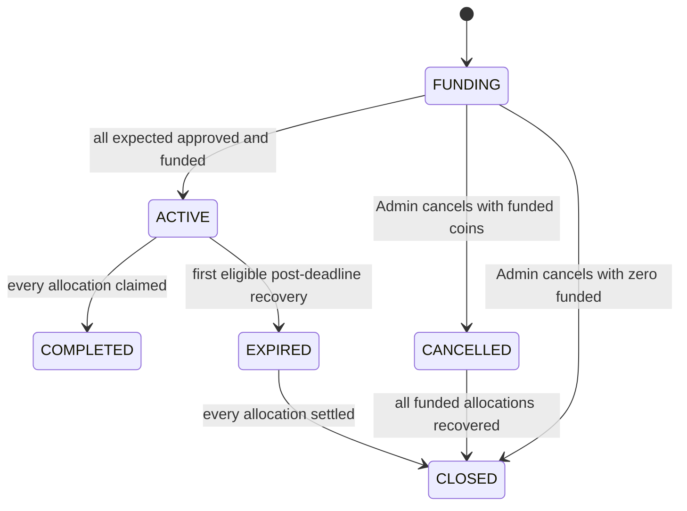

# Balary product requirements

## Overview

Balary is a confidential institutional stablecoin payroll protocol on Midnight. One Gateway converts public USDM into backed shielded zUSDM; one PayrollVault instance represents one payroll run.

## Objectives and non-objectives

Objectives: preserve 1:1 reserve accounting; protect employee/salary inputs; separate Admin, HR, Finance, and Employee authority; support bounded cancellation, expiry recovery, and public redemption. Non-objectives: create a new economic stablecoin, provide exchange liquidity, hide public USDM settlement, operate custody, or claim production/mainnet readiness.

## Actors and assumptions

Admin protects a private role secret and rotates authorities. HR approves salary intent. Finance controls funding and eligible recovery. Employee protects entitlement material. Wallets, indexer, node, and proof server are available; private inputs remain off-chain; token raw units are interpreted by the integrating asset.

## Implemented functional requirements

| Area | Requirement |
|---|---|
| Gateway | Pin non-default USDM color; accept nonzero configured USDM; mint equal zUSDM; maintain equal locked/outstanding totals; accept only zUSDM redemption; burn full coin; release equal USDM. |
| Vault construction | Require institution/payroll IDs, future deadline, positive expected count, Gateway, and nonzero authority commitments. Configuration is sealed. |
| HR | Authenticate from secret-derived authority; approve a unique, randomized commitment binding payroll, employee key, exact value, allocation ID, and blind. |
| Finance | Authenticate; fund only an approved, unfunded intent with exact zUSDM color/value; add allocation commitment to the Merkle tree. |
| Activation | Remain `FUNDING` until approved and funded counts both equal expected count; then become `ACTIVE`. |
| Claim | Require active state, deadline not passed, correct token, employee-secret identity, exact allocation membership, and unused nullifier; send whole coin. |
| Cancellation/recovery | Admin cancels only `FUNDING`; zero-funded closes immediately. Finance recovers cancelled or post-deadline unclaimed coins; recovered/claimed coins cannot be spent again. |
| Rotation | Admin may rotate Admin/HR/Finance commitments without rewriting allocations. |
| Redemption | Convert shielded zUSDM to equal public USDM and decrement both accounting totals equally. |

## State machine

## Privacy, security, and operations

The system must not write raw role secrets, employee identities, salaries, blinds, or openings to ordinary ledger fields. It must use randomized commitments, Merkle membership, domain separation, token-color checks, and unique nullifiers. Operational users must protect secrets and use a trusted/local prover for sensitive witnesses. Public counts and public redemption are accepted current boundaries.

Local uses MockUSDM and the Docker stack. Preview uses external USDM, a funded wallet, tDUST, and protected environment variables. Public CI must not use Preview secrets.

## Success and acceptance criteria

Implemented acceptance is: 32 static checks, 42 model tests, three contracts compile under toolchain 0.31.1, local lifecycle succeeds including separate employee wallet, and Preview evidence records deposit through redemption with equal final totals. These are engineering evidence, not audit or production certification.

## Known limitations and future requirements

No external audit, formal verification, registry, UI, fee sponsorship, batching, or mainnet deployment. Future requirements are institution onboarding, dashboard workflows, sponsored employee transactions, batch/padded payroll, metadata hardening, monitoring, security review, and mainnet operational controls.
