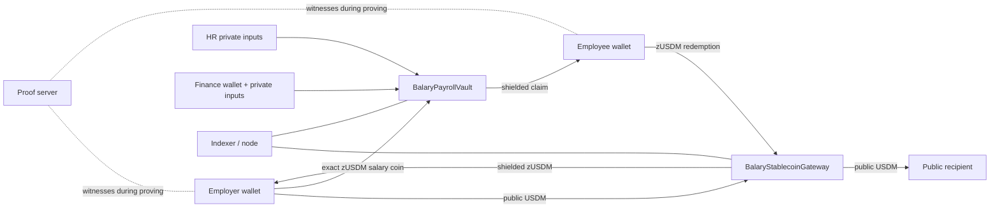

# Architecture

## System context

Balary joins a public settlement asset to a private payroll lifecycle.

## Public/private boundary

Public state includes contract addresses, token colors, Gateway totals, payroll state/configuration, authority and salary commitments, Merkle roots, aggregate counters, and disclosed nullifiers. Private inputs include role/employee secrets, salaries, blinds, coin openings, and Merkle paths. Public USDM deposit/redemption intentionally sits outside the private boundary.

## Components

### Gateway

The immutable `usdmColor` selects the backing asset. `depositUSDM` receives public USDM, mints contract-domain zUSDM, and sends it shielded. `redeemZUSDM` receives/burns a full zUSDM coin and releases equal USDM. `totalLocked` and `totalOutstanding` move together.

### PayrollVault

A vault is one payroll run. Sealed institution ID, payroll ID, Gateway address, derived zUSDM color, expected count, and deadline prevent active reconfiguration. Public authority commitments authorize private secrets. HR intent sets, funded markers, a depth-20 Merkle tree, nullifier sets, and counters drive the lifecycle.

### Provider layer

`src/contracts/` adapts generated artifacts. `src/providers.ts` wires private-state, indexer, ZK config, proof, wallet, and Midnight providers. Local endpoints are node `9944`, indexer `8088`, and prover `6300`. Preview endpoints live in `src/config.ts`; the prover defaults local unless `MIDNIGHT_PROOF_SERVER` is set.

## Environments and deployment

Local development deploys MockUSDM, Gateway, and per-run Vault to the Docker Midnight stack. Preview supplies the external USDM color and does not deploy MockUSDM. Generated contract artifacts are local build output. Preview is not mainnet.

## Trust boundaries

A prover can observe witness data; use a trusted/local prover for salaries. Wallet/private-state storage and secrets are off-chain custody responsibilities. The node/indexer expose public state. Aggregate counts leak metadata. Redemption deliberately returns to public settlement.

## Implementation map

`contracts/` is authoritative Compact code; `src/local/` and `src/preview/` are environment runners; `model/` and `test/` provide deterministic behavioral checks; `scripts/` provides static/compile gates; [Protocol](PROTOCOL.md) defines circuits and invariants.
