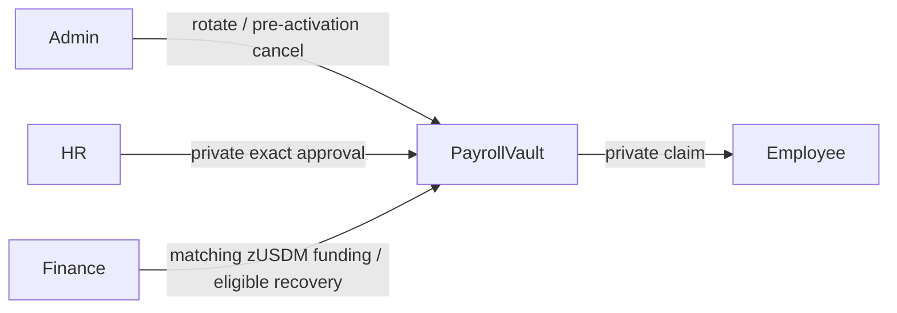

# Institutional roles

One PayrollVault represents one payroll run and separates authority.

| Role | Responsibilities | Prohibited by design |
|---|---|---|
| Admin | Rotate Admin/HR/Finance commitments; cancel only in `FUNDING` | Approve salaries, fund allocations, cancel active payroll |
| HR | Approve blinded intent binding employee, exact value, allocation ID, and blind | Move zUSDM |
| Finance | Fund only exact approved intent; recover eligible unclaimed coins | Invent/change salary, recover claimed coin |
| Employee | Prove secret-derived identity and Merkle membership; claim whole coin | Claim another employee's allocation or reuse claim |

Authority commitments are domain-separated hashes of private secrets. Privileged circuits recompute and compare them. Raw secrets never enter ledger state. `ownPublicKey()` is used only as the shielded destination after authorization or entitlement succeeds.

Admin rotation replaces a public commitment without rewriting salary commitments or allocations. Recovery nullifiers depend on payroll and coin nonce?not the current Finance secret?so rotation cannot create another recovery identity.

